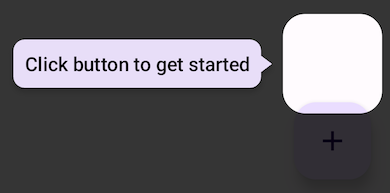

## Reveal effect is misplaced

The reveal effect is not exactly above the element to be revealed.

This should not occur for apps written completely in Compose and is likely an interoperability issue
between legacy Android views and Compose. It might happen when you place a `ComposeView` in a View
layout with other views placed above or around. Reveal
uses [positionInRoot](https://developer.android.com/reference/kotlin/androidx/compose/ui/layout/LayoutCoordinates#(androidx.compose.ui.layout.LayoutCoordinates).positionInRoot())
to determine the position of revealable items. "Root" in this case is the root composable. This issue
does not happen if the root composable is also the root view like in full-compose apps. However
placing the `ComposeView` somewhere else in the view hierarchy might cause this problem.
To work around it, specify the additional offset to be applied to all revealables with the
`revealableOffset` parameter of the `FullscreenRevealOverlayInserter` which is passed to the
`overlayInserter` argument of the `RevealCanvas` composable.
