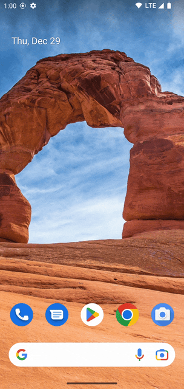

Reveal effect (also known as coach mark, onboarding, tutorial, walkthrough, etc.) with a beautiful
API for [Compose Multiplatform](https://www.jetbrains.com/lp/compose-multiplatform/) targeting
Android, iOS, Desktop and Web.



## Terminology

| Term        | Description                                                                                |
|-------------|--------------------------------------------------------------------------------------------|
| Revealable  | An element which is revealed on the screen.                                                |
| Reveal area | The area which is revealed around the revealable. Usually with a slight padding.           |
| Overlay     | The overlay which greys out all contents except revealable. Can contain explanatory items. |

## Getting started

### Compose Multiplatform

As of version `3.0` Reveal is based on Compose Multiplatform targeting Android, iOS, Desktop and
Web. However please note that except Android the other platforms are currently not well tested and
some of the targets are still alpha or experimental.

When using Reveal on Android, please make sure that the version of Google's Jetpack Compose is
compatible with the version of Compose Multiplatform that Reveal uses, which you can
find [here](./gradle/libs.versions.toml#L5).

### Installation

The minimum supported Android SDK is 23 (Android 6.0), which is a requirement of Jetpack Compose.
Add Reveal as a dependency to your project. It's available on Maven Central.

```kotlin
dependencies {
    implementation("com.svenjacobs.reveal:reveal-core:$REVEAL_VERSION")
}
```

#### Artifacts

| Name            | Description                               |
|------------------|--------------------------------------------|
| `reveal-core`   | Contains core classes. You need this 🙂    |
| `reveal-shapes` | Additional shapes for explanatory items    |

### Compose

The `Reveal` composable is responsible for registration of, interaction with and rendering the
effect for revealable items. There can be many `Reveal` instances; usually there should be at most
one `Reveal` per "screen" of an application. The overlay effect is rendered in a full screen popup,
so `Reveal` can be placed anywhere in the Compose hierarchy, including inside a `ModalBottomSheet`
or `Dialog`, and the effect is always drawn above the rest of that window's content.

```kotlin
@Composable
fun App() {
    MainScreen()
}

@Composable
fun MainScreen() {
    val revealState = rememberRevealState()

    // Usually one instance per screen
    Reveal(
        revealState = revealState,
        onRevealableClick = {},
        onOverlayClick = {},
    ) {
        // Contents
    }
}
```

Inside `Reveal` specify revealable items via the `revealable` modifier.

```kotlin
enum class Keys { HelloWorld }

Column {
    Text(
        modifier = Modifier.revealable(key = Keys.HelloWorld),
        text = "Hello world",
    )
}
```

Now launch the reveal effect via `revealState.reveal(Keys.HelloWorld)`.

Nice, you just launched your first reveal effect. But what is missing is some explanatory item like
text or image next to the reveal area. So let's add one.

Explanatory items are specified via `overlayContent` of the `Reveal` composable.

```kotlin
Reveal(
    overlayContent = { key ->
        when (key) {
            Keys.HelloWorld -> {
                Surface(
                    modifier = Modifier
                        .align(horizontalArrangement = RevealOverlayArrangement.Horizontal.Start)
                        .padding(8.dp),
                    shape = RoundedCornerShape(4.dp),
                    color = Color.White,
                ) {
                    Text("This is an explanation")
                }
            }
        }
    }
) {
    // Contents
}
```

The scope of the overlay content composable provides `align()` modifiers to align the item either to
the start, top, end or bottom of the reveal area. `align()` must be applied to a direct child of the
overlay content; it has no effect on elements nested further down the tree.

`Reveal` provides two click listeners: `onRevealableClick` is called when the reveal area is clicked
with the key of the current revealable as the first argument. `onOverlayClick` is called when the
overlay is clicked somewhere, also with the key argument. Use any of these click listeners to reveal
the next item, for example for some kind of tutorial, or to hide the effect via
`revealState.hide()`.

### Bottom sheets and dialogs

Because the overlay is rendered in a popup attached to whichever window `Reveal` is composed in,
revealables inside a `ModalBottomSheet` or `Dialog` work as long as `Reveal` itself (and its
revealables) are placed *inside* that sheet's or dialog's content, with their own `RevealState`:

```kotlin
ModalBottomSheet(onDismissRequest = { /* ... */ }) {
    val revealState = rememberRevealState()

    Reveal(revealState = revealState) {
        // Sheet contents, revealable via Modifier.revealable(...)
    }
}
```

A `Reveal` placed *outside* the sheet cannot reveal items *inside* it, since they live in different
windows.

That's it for now. For more details have a look at the [demo application](./demo-app) and the
JavaDoc. The library is well documented 😉

## Migrating from a previous version

See [MIGRATION.md](MIGRATION.md) for breaking changes between major versions.

## Frequently Asked Questions

See [FAQ.md](FAQ.md)
