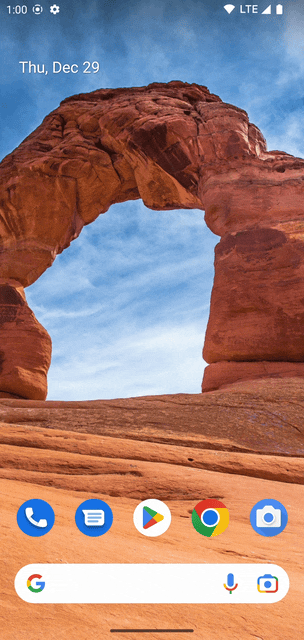

Reveal is a lightweight, simple reveal effect (also known as coach mark, onboarding, tutorial, etc.)
with a beautiful API for [Jetpack Compose](https://developer.android.com/jetpack/compose).



## Terminology

| Term        | Description                                                                                |
|-------------|--------------------------------------------------------------------------------------------|
| Revealable  | An element which is revealed on the screen.                                                |
| Reveal area | The area which is revealed around the revealable. Usually with a slight padding.           |
| Overlay     | The overlay which greys out all contents except revealable. Can contain explanatory items. |

## Getting started

### Installation

Add Reveal as a dependency to your project. It's available on Maven Central.

```kotlin
dependencies {
    implementation("com.svenjacobs.reveal:reveal-core:$REVEAL_VERSION")
}
```

### Compose

Since you probably want the reveal effect to cover the whole screen, the `Reveal` composable should
be one of the top most composables in the hierarchy of your screen-level composable.

```kotlin
@Composable
fun MainScreen(
    modifier: Modifier = Modifier,
) {
    val revealState = rememberRevealState()

    Reveal(
        modifier = modifier.fillMaxSize(),
        revealState = revealState,
        onRevealableClick = {},
        onOverlayClick = {},
    ) {
        // Contents
    }
}
```

Inside `Reveal` specify revealable items via the `revealable` modifier.

```kotlin
enum class Keys { HelloWorld }

Column {
    Text(
        modifier = Modifier.revealable(key = Keys.HelloWorld),
        text = "Hello world",
    )
}
```

Now launch the reveal effect via `revealState.reveal(Keys.HelloWorld)`.

Nice, you just launched your first reveal effect. But what is missing is some explanatory item like
text or image next to the reveal area. So let's add one.

Explanatory items are specified via `overlayContent` of the `Reveal` composable.

```kotlin
Reveal(
    overlayContent = { key ->
        when (key) {
            Keys.HelloWorld -> {
                Surface(
                    modifier = Modifier
                        .align(horizontalArrangement = RevealOverlayArrangement.Horizontal.Start)
                        .padding(8.dp),
                    shape = RoundedCornerShape(4.dp),
                    color = Color.White,
                ) {
                    Text("This is an explanation")
                }
            }
        }
    }
) {
    // Contents
}
```

The scope of the overlay content composable provides `align()` modifiers to align the item either to
the start, top, end or bottom of the reveal area.

`Reveal` provides two click listeners: `onRevealableClick` is called when the reveal area is clicked
with the key of the current revealable as the first argument. `onOverlayClick` is called when the
overlay is clicked somewhere, also with the key argument. Use any of these click listeners to reveal
the next item, for example for some kind of tutorial, or to hide the effect via
`revealState.hide()`.

That's it for now. For more details have a look at the [demo application](./demo-android) and the
JavaDoc. The library is well documented 😉
